<body>
    <h1>Timekart | Watch shopping web portal</h1>
    <h2>Problem Statement:</h2>
    
Create a full stack web application with (HTML, CSS, JS) & (PHP + MySQL)

    <h2>Description:</h2>
    
Timekart is developed to demonstrate the functioning of a shopping website. It allows users to create an account, navigate the products (watches), add them to the cart, and finally make a purchase. The site then sends this purchase request to the admin, where they can view the requested order and also perform other actions to maintain the site.

    <h2>Table of Contents:</h2>
    <ul>
        <li><a href="#installation">Installation</a></li>
        <li><a href="#usage">Usage</a>
            <ul>
                <li><a href="#customer">Customer</a></li>
                <li><a href="#admin">Admin</a></li>
            </ul>
        </li>
        <li><a href="#license">License</a></li>
    </ul>
    <h2 id="installation">Installation:</h2>
    

        <h3>1. Download and Install XAMPP:</h3>
        
If you don't have XAMPP installed, <a href="https://www.apachefriends.org/download.html">download and install it from the official website</a>.

    

    

        <h3>2. Clone the Repository:</h3>
        
Clone this repository to your local machine using the following command:

        <code>git clone https://github.com/devYashraj/Timekart.git</code>
    

    

        <h3>3. Move Files to htdocs:</h3>
        
Copy all the project files, including the database folder, and paste them into the htdocs folder of your XAMPP installation. This is typically located in the XAMPP installation directory (e.g., C:\xampp\htdocs\).

    

    

        <h3>4. Import the Database:</h3>
        <ol>
            <li>Open phpMyAdmin by navigating to <a href="http://localhost/phpmyadmin">http://localhost/phpmyadmin</a> in your web browser.</li>
            <li>Create a new database for your project.</li>
            <li>Select the newly created database and choose the "Import" tab.</li>
            <li>Upload the .sql file from the database folder and execute the import.</li>
        </ol>
    

    

        <h3>5. Access the Application:</h3>
        <ol>
            <li>Open your web browser and navigate to <a href="http://localhost/timekart/login.php">http://localhost/timekart/login.php</a>.</li>
            <li>Login Credentials:</li>
            <ul>
                <li><strong>Admin:</strong></li>
                <ul>
                    <li>Username: admin123</li>
                    <li>Password: admin123</li>
                </ul>
                <li><strong>Customer:</strong> Create a new account if required.</li>
            </ul>
        </ol>
    

    

        <h3>6. Start Using the Application:</h3>
        
You should now be able to access and use the application.

    

    <h2>Usage:</h2>
    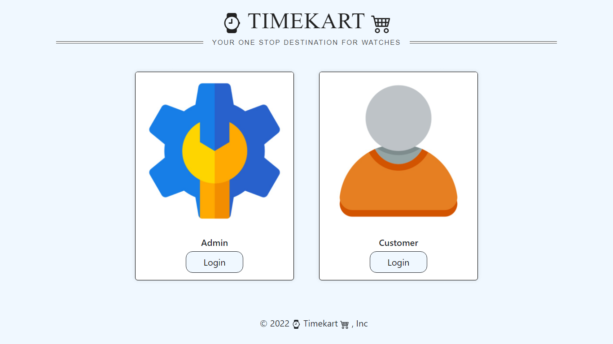
    
This is the first page where you can choose whether to login as admin or customer.

    <h3>Customer:</h3>
    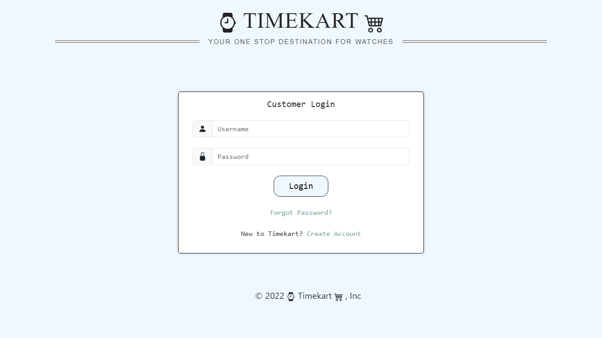
    
This is the customer login page. Enter your credentials or simply create a new account by clicking Create Account.

    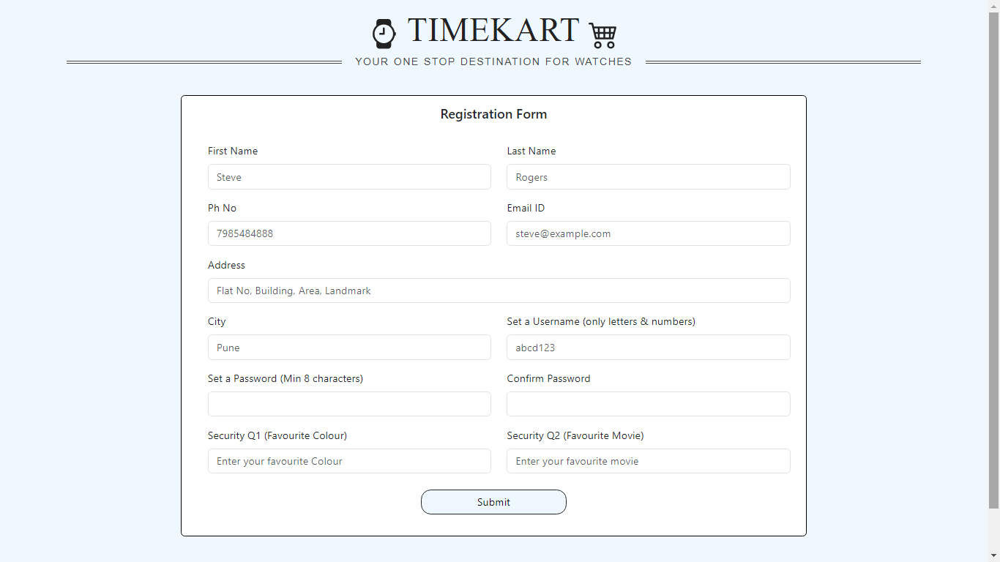
    
This is the registration form for creating a new account. Follow the rules mentioned as placeholders.

    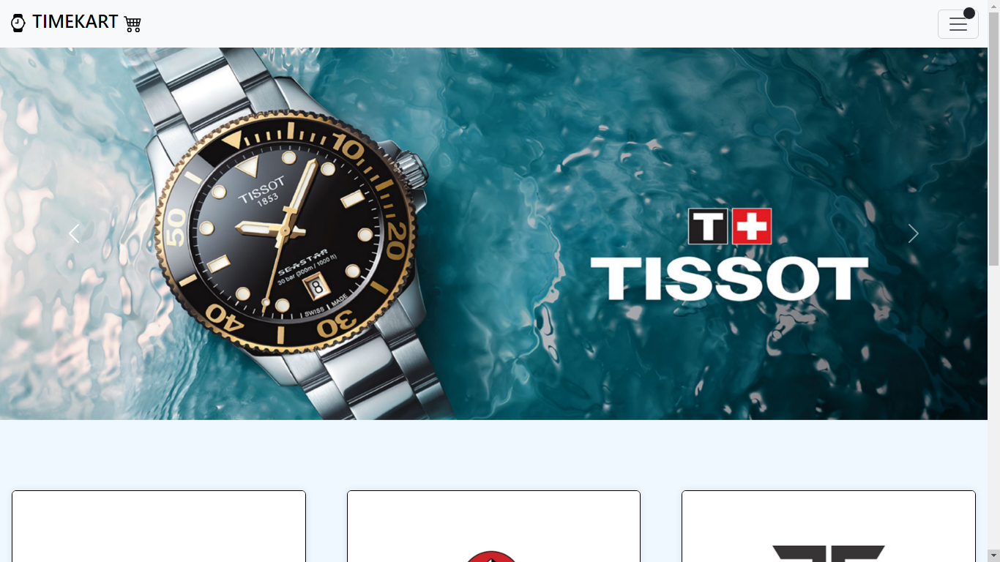
    
This is the home page. A carousel occupies the top of the screen displaying the latest offers.

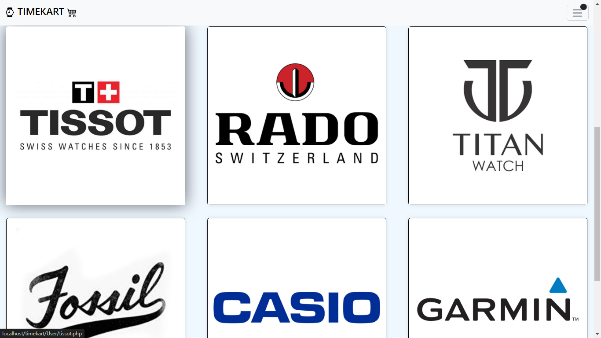
    
Upon scrolling down, there are various cards displaying a unique brand name. Click on a particular card to view that brand's products.

    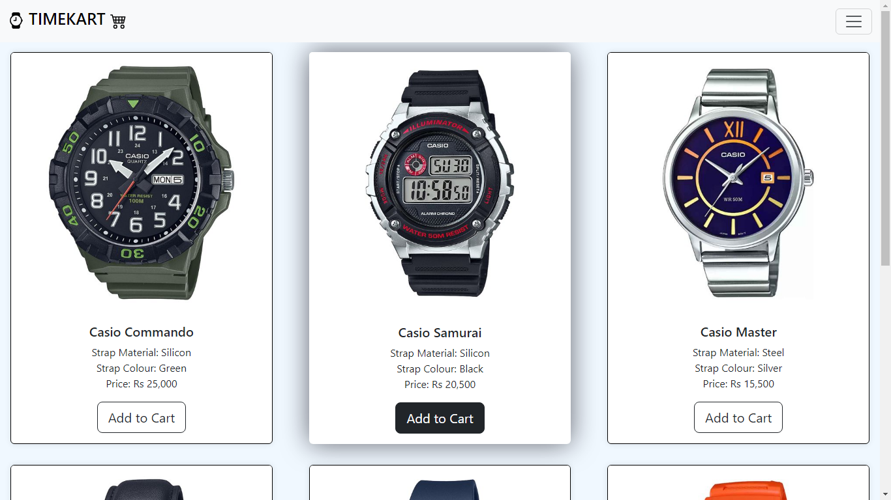
    
Upon clicking on a particular card, you will be directed to the product list of that specific brand. Click "Add to Cart" to add the item to your cart.

    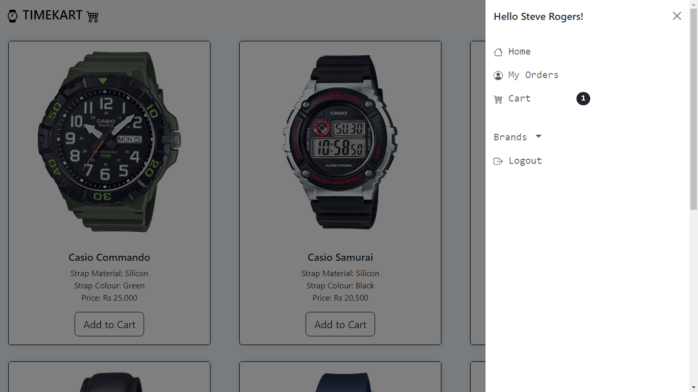
    
Navigate to the cart by clicking the button in the top-right corner and selecting "Cart.".

    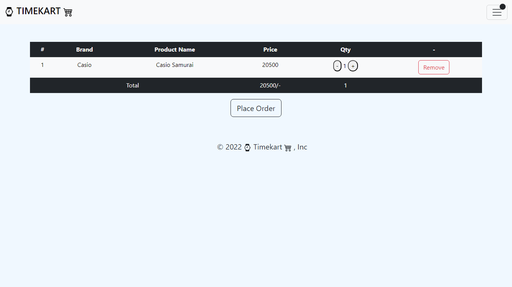
    
This is your cart. You can change the quantity (min = 1, max = 10) and also remove the item. Click "Place Order" to proceed.

    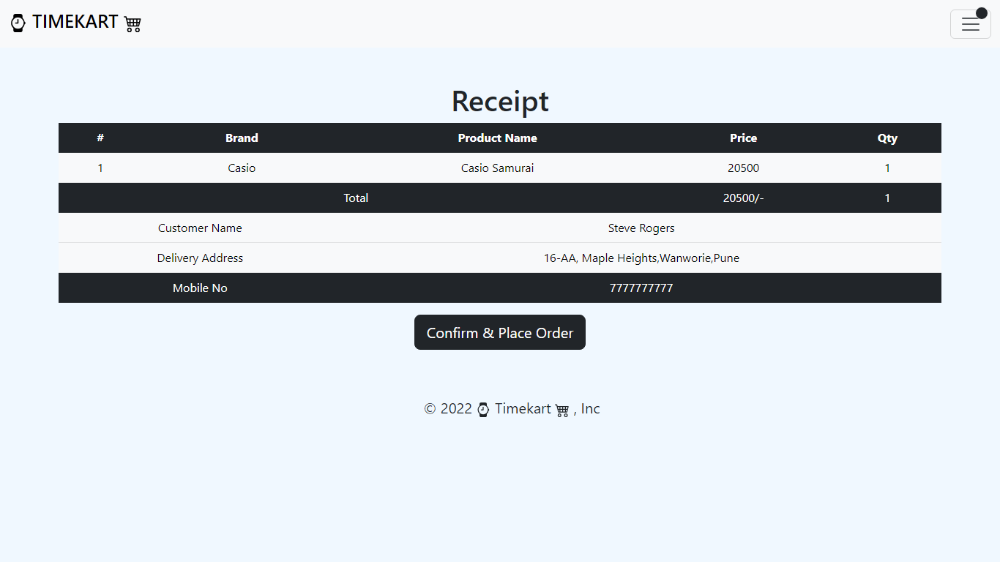
    
This is the final confirmation screen. Click "Confirm & Place Order" to continue. After this, you can download this receipt as a PDF or print it.

   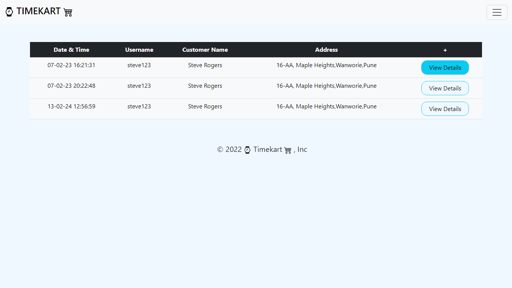
    
To view all the placed orders, navigate to "My Orders" using the navbar.

    <h3>Admin:</h3>
    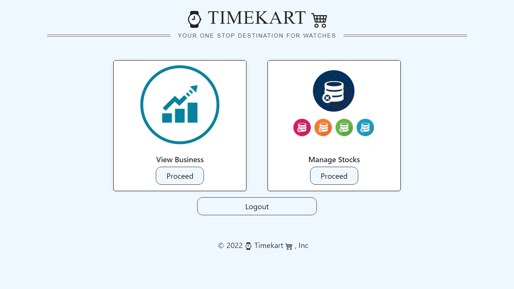
    
This is the admin dashboard. Click on View Business to see business activities or click on Manage stocks to manage stock status of products.

    <!-- Add other admin usage images as needed -->
    <h2 id="license">License:</h2>
    
This project is licensed under the <a href="https://github.com/devYashraj/Timekart/blob/main/LICENSE">MIT License</a> – see license.txt for details.

</body>
