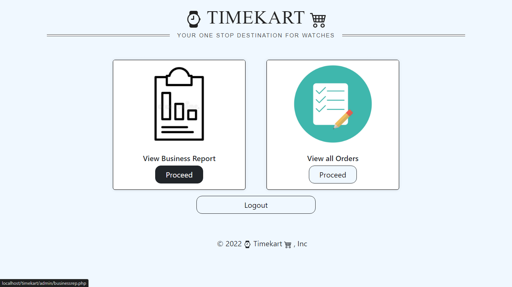
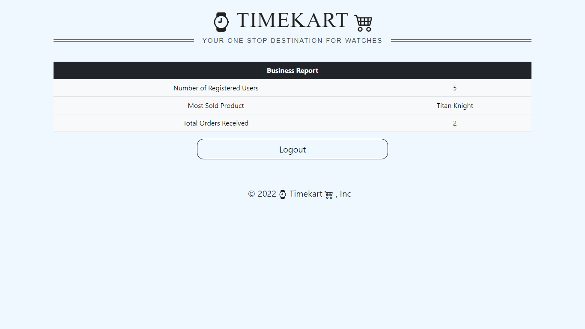
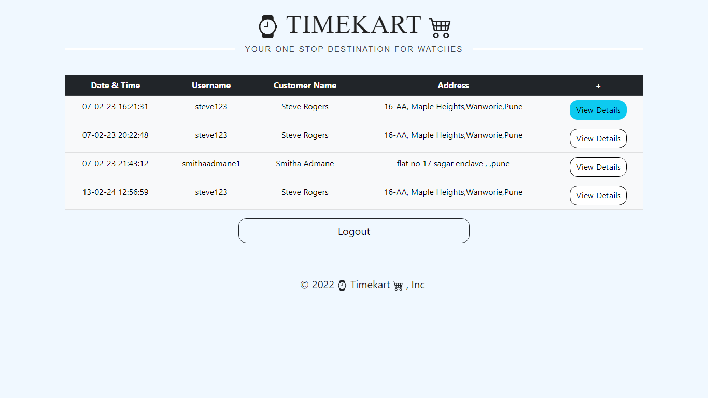
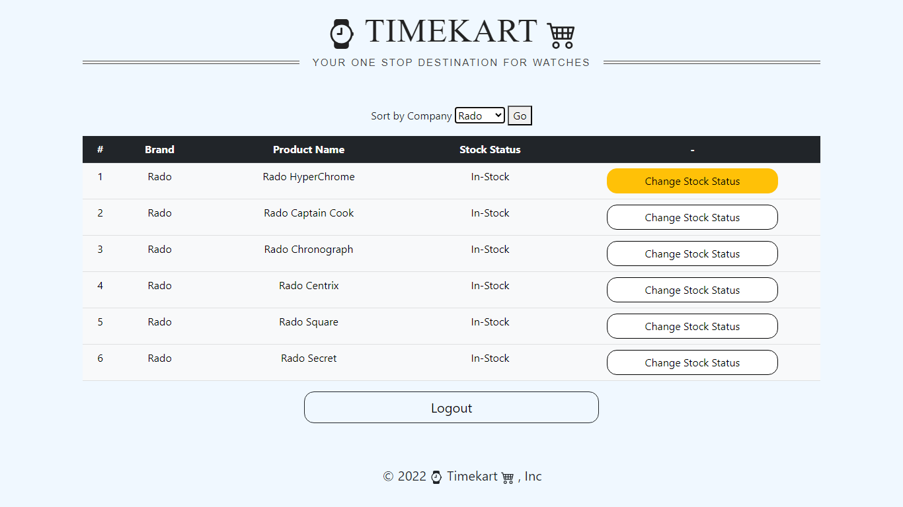

<body>
    <h1>Timekart | Watch shopping web portal</h1>
    
Timekart is developed to demonstrate the functioning of a shopping website. It allows users to create an account, navigate the products (watches), add them to the cart, and finally make a purchase. The site then sends this purchase request to the admin, where they can view the requested order and also perform other actions to maintain the site.

    <h2>Table of Contents:</h2>
    <ul>
        <li><a href="#usage1">Usage</a>
            <ul>
                <li><a href="#customer1">Customer</a></li>
                <li><a href="#admin1">Admin</a></li>
            </ul>
        </li>
        <li><a href="#license1">License</a></li>
    </ul>
    <h2 id="usage1">Usage:</h2>
    
    
This is the first page where you can choose whether to login as admin or customer.

    <h3 id="customer1">Customer:</h3>
    
    
This is the customer login page. Enter your credentials or simply create a new account by clicking Create Account.

    
    
This is the registration form for creating a new account. Follow the rules mentioned as placeholders.

    
    
This is the home page. A carousel occupies the top of the screen displaying the latest offers.

    
Upon scrolling down, there are various cards displaying a unique brand name. Click on a particular card to view that brand's products.

    
    
Upon clicking on a particular card, you will be directed to the product list of that specific brand. Click "Add to Cart" to add the item to your cart.

    
    
Navigate to the cart by clicking the button in the top-right corner and selecting "Cart.".

    
    
This is your cart. You can change the quantity (min = 1, max = 10) and also remove the item. Click "Place Order" to proceed.

    
    
This is the final confirmation screen. Click "Confirm & Place Order" to continue. After this, you can download this receipt as a PDF or print it.

   
    
To view all the placed orders, navigate to "My Orders" using the navbar.

    <h3 id="admin1">Admin:</h3>
    
    
This is the admin dashboard. Click on "View Business" to see business activities or click on "Manage Stocks" to manage the stock status of products.

    
    
This is the business management section. Click on "View Business Reports" to view business activities. Click on "View All Orders" to view all received orders.

    
    
This is the overall report generated that summarizes the ongoing activities.

    
    
This is the "View Orders" section sorted by date and time. Click on "View Details" for more information.

    
    
This is the stock management section. You can sort products by brand name and toggle the status of a product as 'in-stock' or 'out-of-stock'. A product made out-of-stock cannot be purchased by the customer

    <h2 id="license1">License:</h2>
    
This project is licensed under the <a href="https://github.com/devYashraj/Timekart/blob/main/LICENSE">MIT License</a>.

</body>
